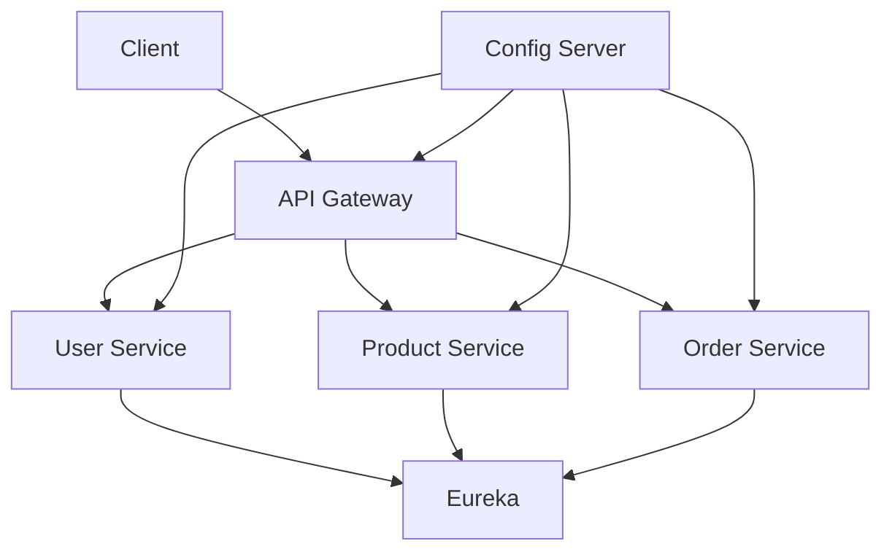
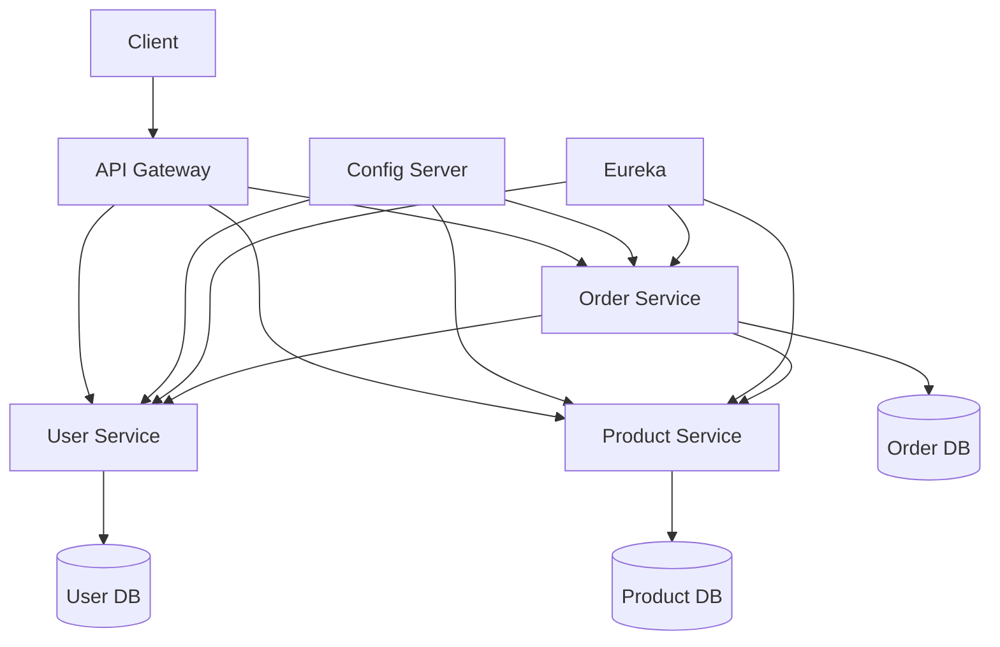
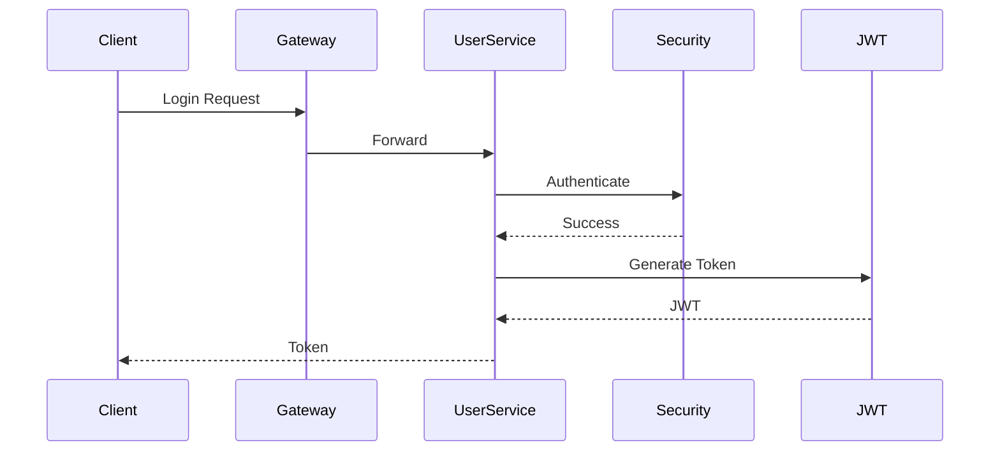
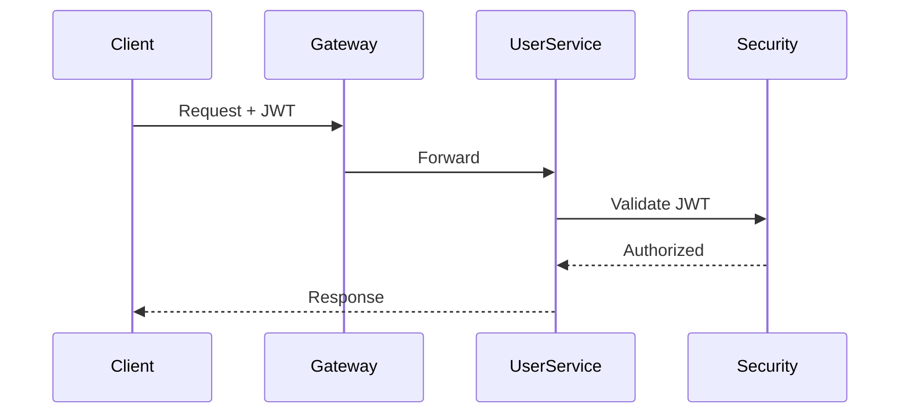
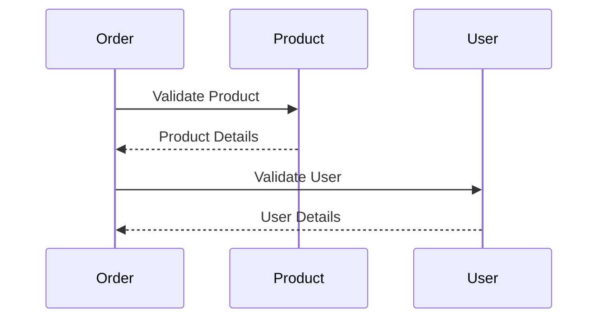
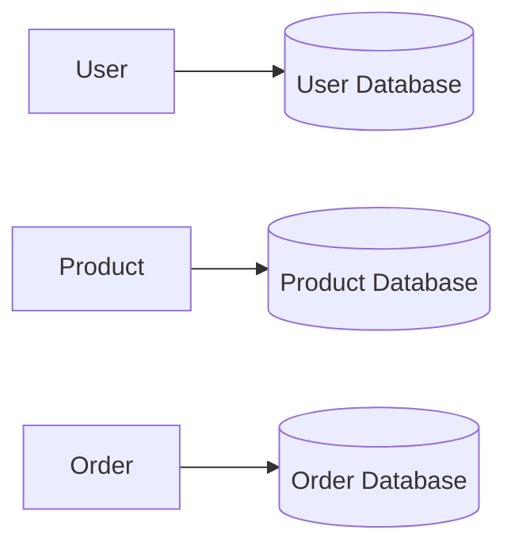

# 🛒 ShopSphere Ecosystem – Ecommerce Microservices Platform

## Overview

**ShopSphere** is a cloud-native ecommerce backend built using Spring Boot microservices architecture.

The system follows distributed design principles where each business capability is developed and deployed independently.

---

## Two Repository Architecture

This ecosystem is organized into two repositories:

1. **Ecommerce-Platform** – Infrastructure and platform services
2. **Ecommerce-ShopSphere** – Core ecommerce business microservices

---

# Repository 1 – Ecommerce-Platform

## Overview

Ecommerce-Platform contains the infrastructure layer required to run the ShopSphere ecommerce ecosystem.

It provides:

- Config Server
- Eureka Discovery
- API Gateway
- Dockerized infrastructure

## Architecture

## Components

### Config Server

Centralized configuration management backed by Git.

### Eureka Server

Dynamic service registration and discovery.

### API Gateway

Single entry point for routing and security.

## Tech Stack

- Java 21
- Spring Boot
- Spring Cloud
- Eureka
- Config Server
- Gateway
- Spring Security
- Docker

## Startup Order

1. Config Server
2. Eureka Server
3. API Gateway
4. Microservices

---

# Repository 2 – Ecommerce-ShopSphere

## Overview

ShopSphere is a microservices-based ecommerce backend.

Key Architecture:

- JWT Authentication
- Spring Security
- REST Client communication
- Database per service
- API Gateway routing
- Service Discovery
- Centralized configuration

---

## Complete Architecture

---

## Spring Security + JWT Authentication Flow

---

## JWT Authorization Flow

---

## Inter-Service Communication

REST client based communication.

---

## Database Per Service

Each microservice owns its own database.

Benefits:

- Independent scaling
- Loose coupling
- Fault isolation
- Independent schema evolution

---

## Microservices

### User Service

Features:

- Registration
- Login
- JWT generation
- Authentication
- User management

Technology:

- Spring Security
- JWT
- JPA

---

### Product Service

Features:

- Product CRUD
- Catalog management
- Inventory

Technology:

- JPA
- PostgreSQL

---

### Order Service

Features:

- Order placement
- Product validation
- User validation
- Service communication

Technology:

- REST Client
- Spring Boot

---

## Tech Stack

Backend:

- Java 21
- Spring Boot
- Spring Security
- JWT
- REST Client
- JPA

Infrastructure:

- Eureka
- Gateway
- Config Server
- Docker

Database:

- PostgreSQL
- Database-per-service

---

## Run Instructions

Start:

1. Config Server
2. Eureka
3. Gateway
4. User Service
5. Product Service
6. Order Service

---

## Future Enhancements

- Kafka
- Kubernetes
- Monitoring
- Distributed tracing
- CI/CD
- Centralize Authentication and Authorization
- Rate Limiting
- Fault Tolerance

## Author

Shital Patil
